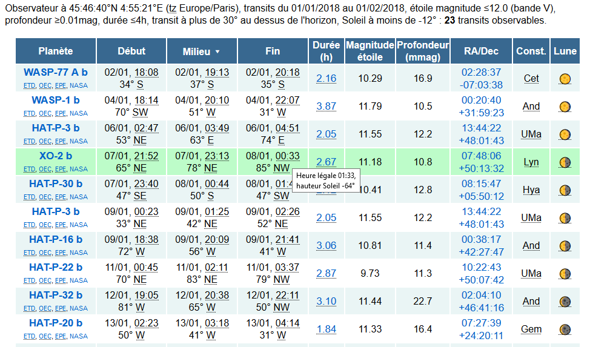

transitephem
============

Changements perso :
```
transitephem.py prend ses paramètres en arguments au lancement
calculateEphemerides.py calcule plus d'éléments et sort une page HTML plus complète
timezonefinder est requis pour déterminer une timezone à part de coordonnées lat/lon
```

Utilisé sur https://www.sendell.com/transitephem

Fourni assurément sans garantie




A Pythonic transiting exoplanet ephemeris generator by [Brett Morris (UW)](http://staff.washington.edu/bmmorris/) for undergraduate observations from the [Manastash Ridge Observatory (MRO)](http://www.astro.washington.edu/users/laws/MRO/home.page/). Requirements include [numpy](http://www.numpy.org/), [PyEphem](http://rhodesmill.org/pyephem/), and [astropy](http://www.astropy.org/). These scripts are largely lifted from [OSCAAR](http://oscaar.github.io/OSCAAR/), and make use of exoplanet data from [exoplanets.org](http://exoplanets.org/). 

The transit time predictions are likely accurate to within an hour -- those transit events with the oldest references likely have the most inaccurate transit time predictions.
